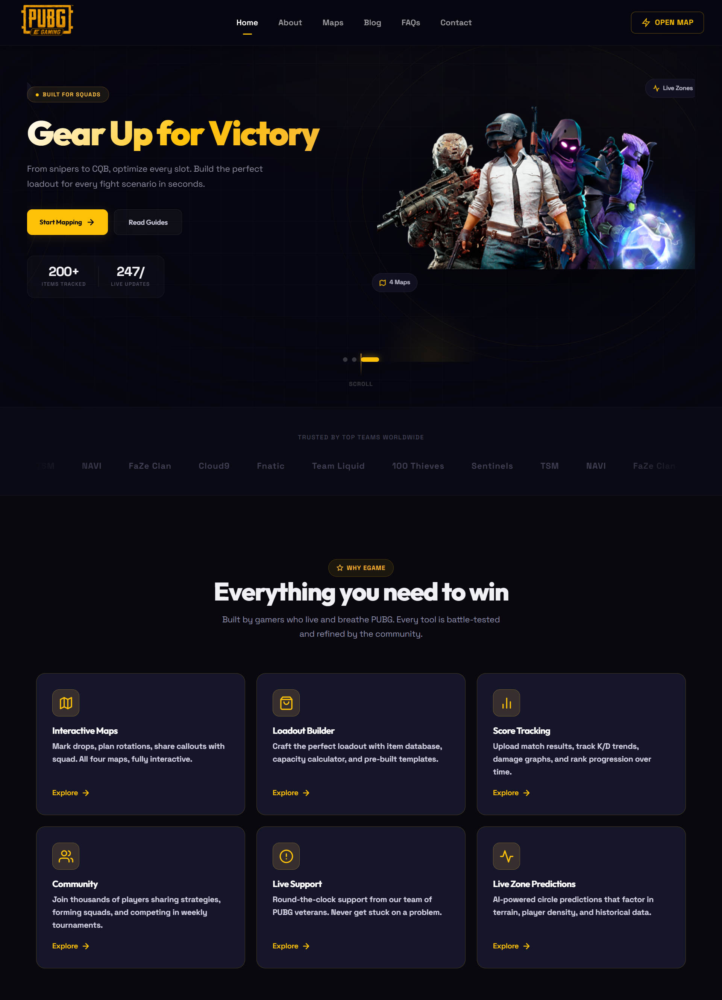

# eGame Website - PUBG Interactive Map & Stats

A React-based interactive website featuring a PUBG map tool with drawing capabilities, game statistics, backpack management, and more.



## Features

- 🗺️ **Interactive Map Tool** - Draw circles, rectangles, lines, and markers on PUBG maps (Erangel, Miramar, Sanhok, Vikendi)
- 📝 **Blog System** - Blog pages with rich text content
- 🔄 **Responsive Design** - Fully responsive with Tailwind CSS

## Tech Stack

- **React 18** - Frontend framework
- **React Router v6** - Routing
- **Leaflet** - Interactive maps
- **Tailwind CSS** - Styling
- **Semantic UI React** - UI components
- **React Quill** - Rich text editor

## Getting Started

### Prerequisites

- Node.js (v14 or higher)
- npm or yarn

### Installation

```bash
# Clone the repository
git clone  https://github.com/MuhammadHashir28/pubg-egame.git

# Navigate to project directory
cd egamewebsite

# Install dependencies
npm install
```

### Development

```bash
# Start development server
npm start
```

The app will be available at `http://localhost:3000`.

### Production Build

```bash
# Create production build
npm run build
```

The build output will be in the `build/` directory, ready for deployment.


